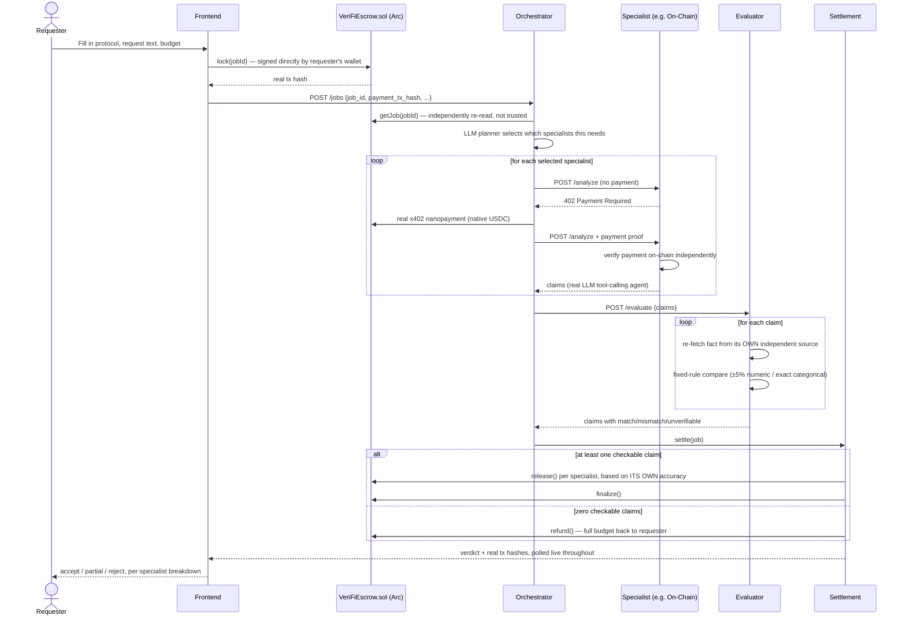

# ArcProof — The First Trust Layer Where Agents Only Get Paid When Their Work Is True

> **A bonded, multi-agent financial diligence network where specialist AI agents research a protocol, an evaluator agent independently re-derives every claim they make against live external data, and payment only settles — per specialist, not per job — when the work checks out.**

---

## The Problem in One Sentence

Agent payment rails (x402) and agent identity/reputation registries (ERC-8004) already exist, but none of them tell you whether the *work* behind a payment was actually correct — a payment record proves money moved, not that the analysis was true.

---

## Why This Matters — Market Context

| Metric | Value | Source |
|---|---|---|
| AI agents market size (2026) | **$10.9B–$15B** → projected **$52.6B–$294.7B by 2030–2035** (34–49% CAGR) | [Precedence Research](https://www.precedenceresearch.com/ai-agents-market), [Grand View Research](https://www.grandviewresearch.com/industry-analysis/ai-agents-market-report) |
| Agentic commerce opportunity | **$900B** US B2C by 2030; **$3–5T** in orchestrated revenue by end of decade | [McKinsey, via Nevermined](https://nevermined.ai/blog/agentic-commerce-growth-statistics) |
| Enterprise agent adoption | **40%** of enterprise apps will embed task-specific agents by end of 2026, up from **<5%** today | [Gartner](https://nevermined.ai/blog/ai-agent-market-size-statistics) |
| x402 agentic payments (Base) | **119M+** cumulative transactions, **$35M+** volume by March 2026 | [Chainalysis](https://www.chainalysis.com/blog/x402-agentic-payments-adoption/) |
| x402 across all chains | **~$600M** processed annually | [BlockEden](https://blockeden.xyz/blog/2026/01/16/x402-protocol-ai-agent-autonomous-payments-http-402/) |
| Circle Q4 revenue | **$770M** (+77% YoY), agent payments cited as a new growth driver | [Stellagent](https://stellagent.ai/insights/circle-stablecoin-agentic-commerce) |
| Arc testnet activity | **166M** transactions processed, ~2.3M/day average, mainnet slated for 2026 | [Stellagent](https://stellagent.ai/insights/circle-stablecoin-agentic-commerce) |
| Cost of getting this wrong | **$2.3B** in Q1 2026 trading losses from AI-misstated financials — regulators called it a *governance failure*, not a technology one | [ChatFin](https://chatfin.ai/blog/how-to-use-ai-to-fix-ai-hallucinations-caused-2-3b-in-trading-losses/), [Fortune](https://fortune.com/2026/04/08/agent-hallucinations-protocol-money-financial-system-economy/) |

**The gap is structural.** FINRA's 2026 oversight report added its first-ever generative-AI section, explicitly warning broker-dealers to build procedures against agents acting *"beyond the user's actual or intended scope and authority."* The payment rails to let agents transact autonomously are maturing fast (x402, Circle Gateway, Arc). Nothing in that stack answers a simpler question: **was the agent's work actually correct before the money moved?**

---

## Three Layers of the Problem

### 1. A Payment Record Isn't a Correctness Record
x402 and similar nanopayment rails prove a transaction settled. They say nothing about whether the specialist that got paid told the truth. An agent can be wrong, out of date, or actively fabricating a claim, and still get paid in full — because payment and verification are two separate, disconnected events.

### 2. Identity/Reputation Registries Punt on Validation
ERC-8004 ("Trustless Agents") gives agents an on-chain identity, a reputation feed, and a *validation registry* — but it deliberately leaves *what counts as valid* to "the specific validation protocol." It's the right abstraction, with an intentional gap. ArcProof is that missing validation protocol, scoped to financial diligence.

### 3. Nobody Re-derives the Claim Independently
Most "verification" in agent demos is another LLM grading the first LLM's homework — persuasive-sounding, not actually independent. A claim about TVL, a price move, a governance outcome, or a sanctions flag is either checkable against a live, independent source or it isn't. If it is, code should re-derive it and compare — not ask a second model if the first one sounds right.

---

## The Solution — ArcProof

```
Without verification (most agent payment demos today):
  specialist claims: "Uniswap TVL is $2.9B"
  orchestrator: pays the specialist
  → nobody ever checks if $2.9B was real

With ArcProof:
  specialist claims: "Uniswap TVL is $2.9B"        (claim_value copied verbatim from its own tool call)
  evaluator:         independently calls DefiLlama itself, gets $2.948B
  evaluator:         |2.9B - 2.948B| / 2.948B < 5%  → MATCH (deterministic code, not an LLM opinion)
  settlement:        releases this specialist's share of the budget — on-chain, for real
  → if it had been a lie, this exact specialist's payout drops, independent of what
    the other specialists on the same job did
```

The evaluator's accept/mismatch/unverifiable decision is **plain, deterministic code** — a fixed ±5% numeric tolerance, exact boolean/entity matching, never an LLM's judgment call. That's what makes the whole "verified, not trusted" claim auditable rather than persuasive-sounding.

---

## What Makes ArcProof Unique

| System | Payment rail | Identity/reputation | Independent verification | Deterministic verdict | Per-specialist settlement |
|---|---|---|---|---|---|
| x402 (alone) | ✅ | ❌ | ❌ | ❌ | ❌ |
| ERC-8004 registries | ❌ | ✅ | ⚠️ hooks only, no protocol | ❌ | ❌ |
| Generic escrow/attestation | ✅ | ❌ | ⚠️ trusts the attestor | ❌ | ⚠️ usually per-job |
| A second LLM "grading" the first | ❌ | ❌ | ⚠️ not independent | ❌ | ❌ |
| **ArcProof** | **✅ real Arc testnet USDC** | **✅ per-agent accuracy score** | **✅ re-derived from a live source, live** | **✅ fixed-rule code** | **✅ each specialist judged on its own claims** |

**Three things no single piece of this stack does alone:**
1. **Claim-level, code-driven re-verification** — not a second opinion, a second independent fetch and a hard comparison.
2. **Per-specialist settlement inside one job** — one specialist can be paid in full while another, in the exact same job, gets docked or withheld, because payout is computed per `provider_agent_id`, not per job.
3. **A safety net that refunds instead of guessing** — if every specialist fails or every claim comes back unverifiable, the job refunds the requester's full budget instead of defaulting to "accept" (a real bug found and fixed during testing — see [Known Issues](#known-issues--lessons-learned)).

---

## Technical Architecture

### System Overview

```
┌─────────────────────────── Browser (Next.js frontend) ───────────────────────────┐
│  / (landing)   /app (submit + live results)   /dashboard   /reputation           │
│  /jobs/[id] (permalink)                                                          │
│                                                                                   │
│  wallet.ts / walletStore.ts  ── viem-backed injected wallet (MetaMask etc.)       │
│    connects → adds/switches to Arc Testnet → signs VeriFiEscrow.lock() directly  │
│    from the browser wallet BEFORE the orchestrator is ever called                │
│                                                                                   │
│  AgentScene3D  ── real-time 3D view of the actual agent network (react-three-    │
│                   fiber) -- every packet is a real from/to log event, not canned  │
└──────────────────────────────────┬────────────────────────────────────────────────┘
                                   │  job_id + payment_tx_hash
                                   ▼
┌─────────────────────────── agent-ts (Fastify services) ──────────────────────────┐
│                                                                                   │
│  Orchestrator (:8000)                                                            │
│  ├─ independently re-reads on-chain lock via escrowContract.getJob() --          │
│  │  never trusts the requester's claim that it locked the budget                 │
│  ├─ LLM planner picks which specialists this specific request actually needs     │
│  ├─ calls each specialist via a real x402 handshake (402 → real Arc tx → retry)  │
│  ├─ hands assembled claims to the evaluator                                      │
│  └─ writes a structured, timestamped per-job event log (who called whom, every   │
│     real tx hash) -- polled live by the frontend while the job is processing     │
│                                                                                   │
│  Specialists — On-Chain (:8001) · News (:8002) · Compliance (:8003)              │
│  └─ real LangChain.js tool-calling agents; claim *type* is filtered in code to    │
│     only what that specialist's own tools can produce, so an LLM can't invent    │
│     an out-of-scope claim just because the wire schema technically allows it     │
│                                                                                   │
│  Evaluator (:8004)                                                               │
│  └─ ZERO LLM calls in the verdict itself -- re-fetches each claim's fact from     │
│     its own independent live source and applies a fixed comparison rule          │
│                                                                                   │
│  Settlement (in-process)                                                         │
│  └─ computes each specialist's payout from ITS OWN claims only, releases/        │
│     withholds through the deployed VeriFiEscrow contract, refunds on failure     │
│                                                                                   │
└──────────────────────────────────┬────────────────────────────────────────────────┘
                                   │  real signed transactions
                                   ▼
┌─────────────────────────── Arc Testnet (chain id 5042002) ───────────────────────┐
│  VeriFiEscrow.sol -- lock() / release() / finalize() / refund() / setSettler()   │
│  Native USDC as gas currency, sub-second finality                                │
│  Circle Developer-Controlled Wallets for every role that needs one               │
└─────────────────────────────────────────────────────────────────────────────────┘
```

A job resolves as **accept** (every checkable claim matched, everyone paid in full), **partial** (some claims mismatched, affected specialists get a reduced cut), or **reject** (majority mismatch) — and a job with zero checkable claims (every specialist failed, or everything came back unverifiable) refunds the requester instead of silently defaulting to accept.

---

## How Circle / Arc / x402 Are Used

### 1. Circle Developer-Controlled Wallets — every role, not just one
`@circle-fin/developer-controlled-wallets` provisions a real wallet set: `requester`, `orchestrator`, and all 3 specialists each hold a genuine Circle-managed wallet (the `escrow` role stays a plain key on purpose — it's the contract's fixed `settler`/owner address). When a role's Circle wallet goes live, the deployed contract's `setSettler()` is called on-chain to update who's allowed to call `release()`/`finalize()`/`refund()`, since the contract only trusts a specific address as `msg.sender`.

### 2. x402 — pay-per-response, not pay-per-job
Every specialist call is a real HTTP 402 handshake: the orchestrator hits `/analyze` with no payment, gets a 402 with a real `PaymentRequirements` body, broadcasts a real signed Arc transaction moving native USDC to the specialist's address, and retries with proof. The specialist's own server independently re-verifies that payment on-chain before answering — the same "don't trust the claim, re-derive the fact" principle the evaluator applies to specialist claims, applied here to payment claims.

```typescript
// packages/core/src/x402.ts — client side
const tx = await chainTransfer(payerPrivateKey, requirements.payTo, priceUsdc, memo);
const payment = { payload: { payer_address, tx_hash: tx.txHash }, accepted: requirements };
return fetch(url, { headers: { "x-payment": encodeProof(payment) }, ... });
```

### 3. Arc Testnet — native USDC as gas, sub-second settlement
Chain id `5042002`, RPC `https://rpc.testnet.arc.network`. USDC is the native gas currency (18 decimals) rather than an ERC-20, which is why the x402 scheme here is `exact-native` instead of the package's default EIP-3009 `transferWithAuthorization` flow — Arc's native USDC doesn't have that function.

### 4. A real deployed escrow contract, not a ledger entry
`VeriFiEscrow.sol` is deployed once; every lock/release/finalize/refund is a mined transaction, independently checkable on [Arc's testnet explorer](https://testnet.arcscan.app). The frontend's own wallet-connect flow signs `lock()` directly from the browser wallet — the orchestrator never performs that step on the requester's behalf when a real wallet is connected, it only independently re-reads the contract afterward to confirm the lock is real.

---

## Full Job Flow



---

## Claim Types & Verification Rules

Fixed set of 7 claim types — anything else a specialist's LLM tries to emit is filtered out in code (not just discouraged in a prompt), since a model can technically ignore its own system prompt:

| `claim_type` | Example | Independent source | Match rule |
|---|---|---|---|
| `tvl` | "TVL is $2.9B" | DefiLlama | ±5% numeric tolerance |
| `price_change` | "Price moved 7% in 7 days" | CoinGecko | ±5% numeric tolerance |
| `wallet_flow` | "Treasury hasn't touched a labeled exchange" | Etherscan v2 (needs a free API key — [see below](#etherscan-key-optional-but-recommended)) | exact boolean match |
| `token_concentration` | "Top-10 holders control 34%" | *(always simulated — needs a paid Etherscan tier, honestly flagged `simulated: true`)* | ±5% numeric tolerance |
| `governance_event` | "Proposal X passed, ended 2026-06-22" | Snapshot GraphQL | shape-aware: date claims compared as dates, winner claims compared exactly (not by substring, so a fabricated `"FABRICATED-For"` can't slip through just for containing the real word `"For"`) |
| `news_incident` | "No corroborated security incident" | GDELT (requires 2+ independent reporting domains to count as verified) | corroboration count |
| `compliance_flag` | "Address is OFAC sanctioned" | a real, curated OFAC SDN snapshot | exact boolean match |

**Job-level verdict:** `accept` if zero mismatches; `partial` if exactly one mismatch; `reject` if a majority of checkable claims mismatch. A `compliance_flag` mismatch is a hard floor — it can never look like a clean accept, regardless of what else went right. Unverifiable claims never count toward mismatch either way.

**Per-specialist settlement:** 0 mismatches → paid in full; ≤1 mismatch → 50%; 2+ → withheld. Computed independently per `provider_agent_id`, so one specialist can be paid in full while another in the *same job* gets docked.

---

## Deployed Contract — Arc Testnet

| | |
|---|---|
| Contract | [`VeriFiEscrow.sol`](agent-ts/packages/contracts) |
| Address | [`0x130b81ff8c630b2d98435d06be74ec7a672a5179`](https://testnet.arcscan.app/address/0x130b81ff8c630b2d98435d06be74ec7a672a5179) |
| Chain | Arc Testnet, chain id `5042002` |
| RPC | `https://rpc.testnet.arc.network` |
| Explorer | `https://testnet.arcscan.app` |

---

## Published SDK — Bring Your Own Agent

The reusable trust layer is extracted and published to npm, framework-agnostic and not locked to DeFi:

| Package | What it is |
|---|---|
| [`@arcproof/sdk`](https://www.npmjs.com/package/@arcproof/sdk) | The generalized core: any `claim_type` string, a `VerifierRegistry` you register your own deterministic verifiers into, `runTrustedJob()` ties lock → gather → verify → settle/refund into one call |
| [`@arcproof/sdk-langchain`](https://www.npmjs.com/package/@arcproof/sdk-langchain) | Wraps any LangChain.js tool-calling agent as a `gatherClaims()` function; also exports an LLM-driven orchestrator that decides which registered specialists a given request actually needs |
| [`@arcproof/sdk-elizaos`](https://www.npmjs.com/package/@arcproof/sdk-elizaos) | A real ElizaOS `Action`/`Plugin` — native orchestrator + specialist builders running on `runtime.useModel()`, zero LangChain dependency required |

Proven vertical-agnostic with two unrelated live examples reusing the identical `@arcproof/sdk` core: `examples/defi-diligence-agent` (the original protocol-treasury vertical) and `examples/lending-apr-agent` (true-APR + borrower-eligibility, a domain with zero shared code from the reference app) — both verified with real transactions, real accepts, and a real caught fabricated claim.

---

## Repository Structure

```
ArcProof/
├── agent-ts/                          # TypeScript backend — PRIMARY, working implementation
│   ├── packages/
│   │   ├── core/                      # @arcproof/core — no HTTP, no LLM framework dependency
│   │   │   └── src/
│   │   │       ├── schema.ts           # Claim/JobRecord/ProviderPayout wire schemas (zod)
│   │   │       ├── chain.ts            # viem: native-USDC transfer + independent verifyTransfer
│   │   │       ├── circleWallet.ts     # Circle Developer-Controlled Wallets client
│   │   │       ├── escrowContract.ts   # lock/release/finalize/refund against VeriFiEscrow
│   │   │       ├── x402.ts             # real 402 handshake, exact-native settlement
│   │   │       ├── evaluator.ts        # DETERMINISTIC verification — zero LLM calls
│   │   │       ├── settlement.ts       # per-specialist payout math + on-chain release
│   │   │       ├── dataSources/        # defillama, price, explorer, governance, news, sanctions
│   │   │       └── store.ts            # JSON-file job + reputation storage
│   │   ├── services/                  # @arcproof/services — Fastify HTTP + LangChain.js agents
│   │   │   └── src/
│   │   │       ├── orchestrator.ts     # POST /jobs, GET /jobs/:id, GET /jobs/:id/logs, GET /reputation
│   │   │       ├── jobLog.ts           # live per-job event log (who called whom, real tx hashes)
│   │   │       ├── langchainPlanner.ts # LLM specialist-selection + memo-writing
│   │   │       ├── specialists/        # onchainAgent, newsAgent, complianceAgent, runAnalysis.ts
│   │   │       └── evaluatorService.ts # thin Fastify wrapper around core/evaluator.ts
│   │   ├── contracts/                  # VeriFiEscrow.json ABI + deploy.ts
│   │   ├── sdk/                        # @arcproof/sdk — published, generalized trust layer
│   │   ├── sdk-langchain/              # @arcproof/sdk-langchain — published
│   │   └── sdk-elizaos/                # @arcproof/sdk-elizaos — published
│   └── examples/
│       ├── defi-diligence-agent/       # SDK proof #1 — the original vertical
│       └── lending-apr-agent/          # SDK proof #2 — an unrelated vertical
│
├── agent/                              # Python backend — reference implementation, ARCHIVED
│                                        # (kept as-is; agent-ts is the direction to build on)
│
├── frontend/                           # Next.js 16 app, connected to agent-ts
│   ├── app/
│   │   ├── page.tsx                    # Landing page
│   │   ├── app/page.tsx                # Submit a job, live activity feed, 3D agent network
│   │   ├── dashboard/page.tsx          # Network-wide stats, wallet balances, full job history
│   │   ├── reputation/page.tsx         # Per-agent accuracy
│   │   └── jobs/[id]/page.tsx          # Job permalink
│   ├── components/
│   │   ├── ActivityLog.tsx             # Live/replayed real per-job event feed
│   │   ├── TransactionLedger.tsx       # Every real on-chain tx a job touched
│   │   ├── AgentScene3D.tsx            # Real-time 3D agent-network view (react-three-fiber)
│   │   └── landing/navigation.tsx      # Site-wide nav (Home / App / Dashboard / Reputation)
│   └── lib/
│       ├── wallet.ts, walletStore.ts   # viem-backed injected wallet, Arc network add/switch
│       └── api.ts                      # Typed orchestrator client
│
├── HACKATHON.md                        # Original PRD / hackathon reference (historical context)
└── STATUS.md                           # Working log of what's done / what's left
```

---

## Tech Stack

| Layer | Technology |
|---|---|
| Backend runtime | Node.js, TypeScript, npm workspaces |
| HTTP services | Fastify 5, `@fastify/rate-limit`, `@fastify/cors` |
| Agent framework | LangChain.js (`@langchain/core`, `@langchain/langgraph`) |
| LLM providers | Groq → OpenRouter → Gemini → Anthropic → OpenAI (checked in that order) |
| Chain client | viem |
| Wallets | `@circle-fin/developer-controlled-wallets` (Circle Developer-Controlled Wallets) |
| Schema/validation | Zod |
| Frontend framework | Next.js 16 (App Router, Turbopack), React 19, TypeScript |
| Styling | Tailwind CSS v4 |
| State | Zustand (client), TanStack Query (server) |
| 3D | Three.js, `@react-three/fiber`, `@react-three/drei`, `@react-three/postprocessing` |
| Chain (frontend) | viem, injected EIP-1193 wallet (MetaMask etc.) |
| Testnet | Arc Testnet (chain id `5042002`), native USDC gas |
| Live data sources | DefiLlama, CoinGecko, Snapshot, GDELT, Etherscan v2, a curated OFAC SDN snapshot |

---

## Local Setup

### Prerequisites
- Node.js 20+
- An injected browser wallet (MetaMask etc.) configured for Arc Testnet
- At least one LLM API key (Groq recommended — generous free tier, solid tool-calling)
- Arc testnet native USDC in the wallets that need to transact (see `agent-ts/README.md` for the faucet/funding flow)

### Install

```bash
cd agent-ts && npm install
cd ../frontend && npm install
```

### Environment

**`agent-ts/.env`** (copy from `.env.example`):
```env
GROQ_API_KEY=...                # or another provider llm.ts supports
# Optional -- upgrades wallet_flow from simulated to a live Etherscan v2 read
ETHERSCAN_API_KEY=
# Optional -- Circle Developer-Controlled Wallets for every role
CIRCLE_API_KEY=
CIRCLE_ENTITY_SECRET=
# Optional -- basic hardening, unset by default for zero-config local dev
API_KEY=
FRONTEND_ORIGIN=http://localhost:3000
```

**`frontend/.env`**:
```env
NEXT_PUBLIC_ORCHESTRATOR_URL=http://127.0.0.1:8000
NEXT_PUBLIC_ARC_EXPLORER=https://testnet.arcscan.app
NEXT_PUBLIC_API_KEY=              # must match agent-ts's API_KEY exactly, if set
```

#### Etherscan key (optional, but recommended)
`wallet_flow` only needs Etherscan's **free tier** — sign up at etherscan.io, generate a key, and calls resolve against the current v2 API (`chainid=1` for Ethereum mainnet, where the diligenced protocols' real treasury wallets live — separate from Arc, which is only where payment settles). `token_concentration` needs a paid tier regardless and always stays clearly flagged `simulated: true`.

### Run

```bash
# Terminal 1 — all 5 backend services (orchestrator + 3 specialists + evaluator)
cd agent-ts && npm run services --workspace=@arcproof/services

# Terminal 2 — frontend
cd frontend && npm run dev
```

Open `http://localhost:3000`.

### Deploy the escrow contract yourself (optional — a deployed instance already exists)

```bash
cd agent-ts
npm run deploy-contract
```

Copy the printed address into `agent-ts/.env` and it'll be served to the frontend automatically via `GET /config`.

---

## End-to-End Test Flow

1. **Connect wallet** on `/app` — adds/switches to Arc Testnet if needed.
2. **Fill in the form** — protocol slug (a DefiLlama slug like `uniswap`, `aave`, `lido`), a diligence request, budget, optionally a compliance target address (a real OFAC-sanctioned demo address is one click away) and a fault-injection option for testing.
3. **Submit** — signs a real `lock()` transaction directly from your wallet, then the orchestrator independently re-verifies it on-chain before doing anything else.
4. **Watch it live** — the activity feed and 3D agent-network view both update in real time as specialists get called and paid, the evaluator re-derives each claim, and settlement releases per-specialist.
5. **See the verdict** — accept (full payment), partial (some claims didn't hold up), or reject (most didn't) — with a permanent Transaction Ledger linking every real tx to Arc's explorer.
6. **Check `/dashboard` or `/reputation`** — the outcome updates each specialist's live accuracy score and shows up in the full job history immediately.

To watch the evaluator catch a lie live, pick "Inject a fault" before submitting — it forces one specialist to fabricate a specific claim so you can see the mismatch, the reduced payout, and the job-level verdict shift, all with real transactions.

---

## Known Issues / Lessons Learned

- **Free-tier LLM providers aren't reliable enough alone.** `llm.ts` checks providers in order (Groq → OpenRouter → Gemini → Anthropic → OpenAI); Groq occasionally rejects a *correct* tool-call response with a formatting error, so each specialist retries once automatically before giving up.
- **Zero-claims jobs used to keep the requester's money stuck forever** — fixed: a job with no checkable claims (every specialist failed, or everything was unverifiable) now refunds instead of defaulting to "accept."
- **Turning on a role's Circle wallet changes its on-chain address** — the deployed contract's `settler` has to be updated via `setSettler()` afterward, or `release()`/`finalize()`/`refund()` will be rejected as coming from the wrong address.
- **A specialist's LLM can invent an out-of-scope claim type** if the wire schema technically allows every type — fixed by filtering claims to each specialist's own allowed types in code after the LLM responds, not by trusting its own claim_type choice or narrowing its output schema (the latter traded one Groq tool-calling failure mode for a different one).

---

## Acknowledgements

- [Circle](https://www.circle.com/) — Developer-Controlled Wallets, USDC
- [Arc](https://www.arc.network/) — the stablecoin-native L1 this settles on
- [x402](https://x402.org/) — the HTTP-native payment standard this project's nanopayments follow
- [LangChain](https://www.langchain.com/) / [ElizaOS](https://www.elizaos.ai/) — the two agent frameworks the SDK adapts to
- [DefiLlama](https://defillama.com/), [CoinGecko](https://www.coingecko.com/), [Snapshot](https://snapshot.org/), [GDELT](https://www.gdeltproject.org/) — the live data sources the evaluator independently checks against

---

## License

Not yet decided.
